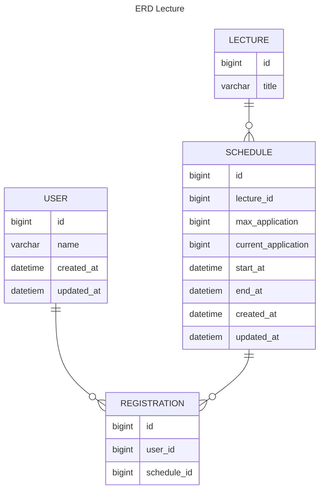

```mermaid
---
title : ERD Lecture
---

erDiagram
USER{
    bigint id
    varchar name
    datetime created_at
    datetiem updated_at
}
REGISTRATION{
    bigint id
    bigint user_id
    bigint schedule_id
}

LECTURE{
    bigint id
    varchar title
}

SCHEDULE{
    bigint id
    bigint lecture_id
    bigint max_application
    bigint current_application
    datetime start_at
    datetiem end_at
    datetime created_at
    datetiem updated_at
}

    USER ||--o{ REGISTRATION : ""
    SCHEDULE ||--o{ REGISTRATION : ""
    LECTURE ||--o{ SCHEDULE : ""
```