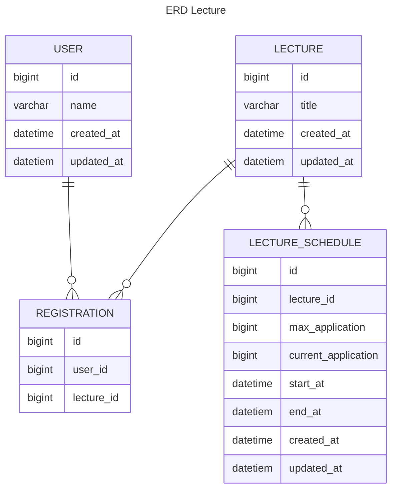

## ERD 설계 및 설명
- 유저, 신청, 강의, 강의계획 테이블로 관련 정보를 저장합니다.
- 유저는 중복되지 않는한 여러 강의를 수강 가능 
- 강의 역시 30명의 수강생을 받는다.

### 사용자 테이블
- 회원가입은 생략이 되어 회원의 정보는 간략하게 되어있다.
- 
### 신청내역 테이블
- 사용자가 신청한 강의 내역을 저장
- 사용자와 강의 의 다대다 관계를 표현하기 위해 설계

### 강의 테이블
- 강의 정보를 담고 있는 테이블

### 강의 계획 테이블
- 강의 계획 정보를 가지고 있다.
- 하나의 강의는 여러 시간 및 날짜가 있기 때문에 스케줄 테이블을 추가함

